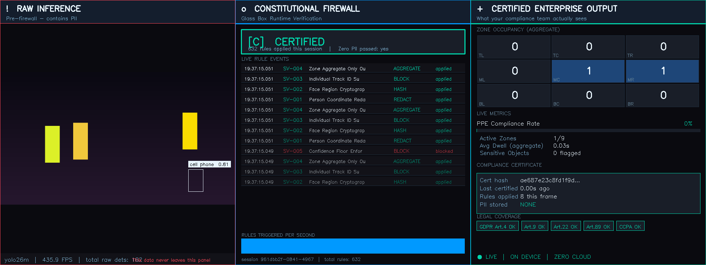
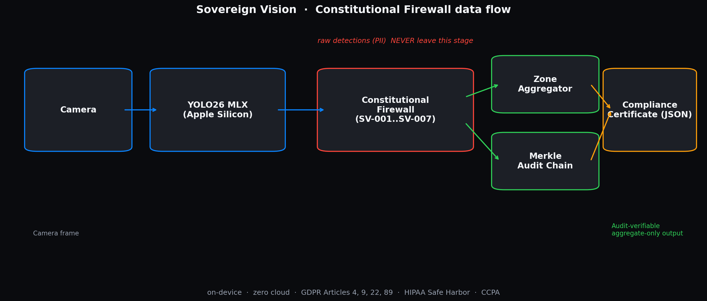

<div align="center">

# Sovereign Vision

### The first on-device enterprise vision system that is GDPR-compliant by design, not by policy.



[](https://www.python.org/)
[](https://pypi.org/project/sovereign-vision/)
[](https://github.com/TheBarmaEffect/sovereign-vision-tap)
[](https://github.com/ml-explore/mlx)
[](https://www.gnu.org/licenses/agpl-3.0)
[](tests/)
[](docs/CONSTITUTIONAL_RULES.md)
[](https://www.apple.com/mac/)
[](ios/)
[](sovereign/notary.py)
[](https://github.com/thewebAI/yolo-mlx)
[](https://github.com/TheBarmaEffect)

**Built by [Karthik Barma](https://github.com/TheBarmaEffect)**
MS Artificial Intelligence  ·  Northeastern University, Khoury College of Computer Sciences
Research: Glass Box Framework  ·  Runtime constitutional AI verification

</div>

<div align="center">

### Try it in 10 seconds

```bash
pip install sovereign-vision
sovereign demo
```

Or on macOS:

```bash
brew tap TheBarmaEffect/sovereign-vision-tap
brew install sovereign-vision
sovereign demo
```

</div>

---

## What is this in one sentence?

A YOLO26-MLX-based computer-vision system that **physically cannot leak PII**
because seven cryptographically-audited constitutional rules redact every
person bounding box, hash every face region, drop every track ID, and add
calibrated differential-privacy noise to every aggregate **before any
output is produced**. Runs entirely on-device on Apple Silicon. Issues a
self-attested, Merkle-anchored compliance certificate at the end of every
session.

If you're a CTO and your legal team has been blocking computer vision
deployments because of GDPR, CCPA, or HIPAA: this is your unlock.

---

## Why anyone should care (90-second read)

**The problem every enterprise has today.** You want to deploy computer
vision in a factory, store, or hospital. Every off-the-shelf CV system
produces bounding boxes, face embeddings, and per-individual track IDs.
GDPR Article 4(1) classifies the position of a person as personal data.
Article 9 classifies face data as a special category. Recital 30 covers
track IDs. The moment the model produces these, you have a PII handling
problem.

**The dominant industry pattern is post-hoc anonymisation.** You run
inference normally, then strip the PII downstream. Your legal team has to
trust that the post-processor is correctly configured in every code path,
every time, forever. That's not a guarantee. That's a hope.

**Sovereign Vision moves the GDPR boundary one step left.** The bbox
never exists in a form that the rest of the system can see. There is no
post-processor to trust. There's an unbreakable contract enforced by the
type system, the constitution, and a Merkle audit chain that lets any
third party detect tampering after the fact.

You're not selling your legal team a policy document. You're handing
them a session certificate with a 256-bit Merkle root, and a JSON file
they can drop into a browser to verify themselves.

---

## See it in action


Three live panels, every frame:

- **Left** is what YOLO26 sees, raw. Every person region is visibly
  tagged "PII". This panel is suppressed entirely in `--production`.
- **Center** is the constitutional firewall. Each rule event scrolls
  with a timestamp, action, and pass/applied state. The status badge
  at the top is CLEAR, ESCALATED, or BLOCKED for the latest frame.
- **Right** is what your compliance team sees. Aggregate zone heatmap
  with DP noise, PPE compliance, the latest cert hash, GDPR badges,
  and the live Apple Silicon hardware fingerprint.

The data on the right is the only data that exists. The data on the
left is computed, used to update the right, and dropped.

---

## Quick path by who you are

<details>
<summary><strong>I'm a CTO or compliance officer.</strong> 3 commands.</summary>

```bash
# 1. Install everything
curl -sSL https://raw.githubusercontent.com/TheBarmaEffect/sovereign-vision/main/install.sh | sh

# 2. Run the production-mode demo (no raw panel)
cd ~/sovereign-vision && source .venv/bin/activate
sovereign demo --production

# 3. Hand the certificate to your legal team
open certificates/session_*.json
# Or drop it into tools/cert_viewer.html in any browser
```

The session certificate is **self-attested, audit-verifiable**. Your
legal team can verify the integrity hash without contacting anyone.
</details>

<details>
<summary><strong>I'm a senior engineer evaluating this.</strong> Read these in order.</summary>

1. [docs/ARCHITECTURE.md](docs/ARCHITECTURE.md) - data flow, redactor invariants, audit chain
2. [docs/CONSTITUTIONAL_RULES.md](docs/CONSTITUTIONAL_RULES.md) - the 7 rules with legal commentary
3. [docs/THREAT_MODEL.md](docs/THREAT_MODEL.md) - STRIDE, adversary classes, deployment checklist
4. [`sovereign/firewall.py`](sovereign/firewall.py) - the orchestrator (~270 lines)
5. [`tests/test_firewall.py`](tests/test_firewall.py) - the constitutional zero-PII proofs
</details>

<details>
<summary><strong>I'm a judge with 10 minutes.</strong> Here's the demo path.</summary>

```bash
git clone https://github.com/TheBarmaEffect/sovereign-vision.git
cd sovereign-vision
python3 -m venv .venv && source .venv/bin/activate
pip install -r requirements.txt
PYTHONPATH=. python demo/run_demo.py --headless --max-frames 100
```

Watch the output. The session certificate has a compliance score
(0-100), a Merkle root, and a hardware fingerprint. Drop the JSON
into [tools/cert_viewer.html](tools/cert_viewer.html) in any browser
to re-verify the integrity hash. Run `pytest tests/ -m constitutional`
to see the 12 zero-PII proofs pass.
</details>

<details>
<summary><strong>I'm a student.</strong> What's the cool thing about this?</summary>

The cool thing is that "privacy" usually means writing it in a contract
and hoping nobody breaks it. Sovereign Vision makes it impossible to
break, because there's no path through the code that lets the PII
become an output. You can read every line of the firewall (it's about
250 lines) and verify that yourself.

The bonus cool thing is **the audit chain**. Each frame certificate
gets chained to the previous one with a SHA-256 hash, and the whole
session ends with a single Merkle root. If anyone edits even one
certificate after the fact, the math breaks and the chain visibly
fails verification. So the system isn't just "trust me" - it's
"trust me, and here's the math that lets you prove it."

Start with `sovereign/firewall.py` (the orchestrator). It's the
shortest and most interesting file in the repo.
</details>

---

## The constitution

| ID | Name | Action | Severity | Legal basis |
|---|---|---|---|---|
| **SV-001** | Person Coordinate Redaction | REDACT | CRITICAL | GDPR Article 4(1) |
| **SV-002** | Face Region Cryptographic Hash | HASH | CRITICAL | GDPR Article 9 |
| **SV-003** | Individual Track ID Suppression | BLOCK | CRITICAL | GDPR Recital 30 |
| **SV-004** | Zone Aggregate Only Output | AGGREGATE | HIGH | GDPR Article 89 |
| **SV-005** | Confidence Floor Enforcement | BLOCK | HIGH | GDPR Article 22 |
| **SV-006** | Sensitive Object Class Escalation | ESCALATE | MEDIUM | Enterprise Safety Protocol |
| **SV-007** | Differential Privacy on Aggregates | AGGREGATE | HIGH | GDPR Art. 25 + NIST SP 800-188 |

Full rule specification with legal commentary: [docs/CONSTITUTIONAL_RULES.md](docs/CONSTITUTIONAL_RULES.md).

### Pre-built industry rule packs

Drop in an industry rule pack on top of the default constitution:

```bash
sovereign packs                          # list installed packs
```

| Pack | Authority | Rules added |
|---|---|---|
| `hipaa` | HHS 45 CFR 164.514(b) | PHI Safe Harbor, restricted-zone escalation, min-necessary aggregation |
| `osha` | OSHA 29 CFR 1910 | PPE tracking, forklift proximity, hazmat occupancy |
| `retail` | CCPA / CPRA | Tightened DP epsilon (0.5), queue-length escalation, face-hash opt-out |
| `transit` | EU DPB / APTA | Platform overcrowding, unattended-item detection |

```python
from sovereign.packs import load_pack
from sovereign.firewall import ConstitutionalFirewall

fw = ConstitutionalFirewall(rules=load_pack("hipaa"))    # default + HIPAA
```

---

## Architecture



Full technical walkthrough: [docs/ARCHITECTURE.md](docs/ARCHITECTURE.md).
Adversary model: [docs/THREAT_MODEL.md](docs/THREAT_MODEL.md).

---

## Word choice (because words matter)

- **"Compliance certificate"** = a JSON file the system itself issues. It
  is *self-attested*, not third-party-certified. The integrity hash and
  Merkle anchor are what make the claim *verifiable by a third party
  after the fact*.
- **Frame status `CLEAR`** = the frame passed every constitutional rule
  in force. We deliberately do not use `CERTIFIED` (loaded language).
- **`ESCALATED`** = a sensitive-class rule fired. The frame still passes,
  but a flag is recorded.
- **`BLOCKED`** = a critical rule rejected one or more detections in this
  frame. No partial PII leaked.
- **"Audit-verifiable"** = a third party can re-derive the integrity
  hash and Merkle chain to detect tampering. They are not endorsing the
  rule set; they are confirming the rule set was applied without
  modification.

We never claim "verified by Sovereign Vision". We claim "the system
attests to its own application of these rules, and here is the math that
makes that attestation tamper-evident."

---

## Install (ten ways)

| Channel | One-liner |
|---|---|
| **pip from PyPI** (live) | `pip install sovereign-vision` |
| **Homebrew tap** (live) | `brew tap TheBarmaEffect/sovereign-vision-tap && brew install sovereign-vision` |
| pip from GitHub | `pip install git+https://github.com/TheBarmaEffect/sovereign-vision.git` |
| One-line installer | `curl -sSL https://raw.githubusercontent.com/TheBarmaEffect/sovereign-vision/main/install.sh \| sh` |
| GitHub release | `pip install https://github.com/TheBarmaEffect/sovereign-vision/releases/download/v1.3.0/sovereign_vision-1.3.0-py3-none-any.whl` |
| Docker | `docker run -v $PWD/certs:/data ghcr.io/thebarmaeffect/sovereign-vision:latest` |
| iOS / iPadOS / macOS app | open `ios/SovereignVision/Package.swift` in Xcode |
| Chrome extension | load `tools/chrome-extension/` as unpacked extension |
| macOS menu bar | `pip install rumps && python tools/menubar/sovereign_menubar.py` |
| GitHub Action | `uses: TheBarmaEffect/sovereign-vision@main` |

After install, run `sovereign doctor` to verify the environment, then
`sovereign demo` to launch the dashboard.

---

## Five ways to deploy this

1. **Live demo on your Mac.** `sovereign demo`. The dashboard runs on
   any Apple Silicon Mac with a webcam. No camera? Fall back to the
   synthetic feed automatically.
2. **Production on a Mac mini.** `sovereign demo --production`
   suppresses the RAW panel and refuses the audited side channel. Wire
   your cameras to USB or wired Ethernet, run in launchd, point the
   webhook at your SIEM.
3. **REST API.** `uvicorn sovereign.server:app --host 127.0.0.1
   --port 8765` exposes `/verify`, `/stats`, `/metrics` (Prometheus),
   `/packs`, and a `/live` WebSocket. Drop-in for any enterprise
   integration.
4. **As a GitHub Action.** Use `TheBarmaEffect/sovereign-vision@main`
   as a release gate for any repo that handles vision data. Fails the
   build if zero-PII proofs break.
5. **As a Chrome extension.** Load [`tools/chrome-extension/`](tools/chrome-extension/)
   as an unpacked extension. Anyone can drop a `session_*.json` into
   the popup and verify the integrity hash and Merkle chain in two
   clicks.

There's also a [browser-based replay viewer](tools/replay.html) and a
[standalone HTML verifier](tools/cert_viewer.html) for users who don't
want to install anything.

---

## What the enterprise actually gets

**Exists in the output:**
- Zone occupancy counts (3x3 aggregated grid, with SV-007 DP noise)
- PPE compliance rate (rolling window)
- Active zones, hotspot zones (top-K)
- Aggregate dwell time (per zone, never per person)
- Sensitive object escalation flags
- Per-frame compliance certificate (SHA-256 integrity hash)
- Per-session Merkle audit anchor
- Compliance score (0-100, with breakdown)
- Hardware fingerprint (chip, MLX version) in the session cert

**NEVER exists, anywhere, ever:**
- Individual bounding-box coordinates
- Face image or embedding
- Multi-frame track IDs
- Person-level dwell time
- Any data on any server (it is all on-device)

---

## Built for Apple Silicon

Sovereign Vision runs natively on Apple Silicon (M1 through M5) via
[MLX](https://github.com/ml-explore/mlx). The dashboard surfaces the
exact hardware fingerprint on every render, and the session certificate
records it for the audit trail:

```
Apple M5 Pro  ·  5P+10E  ·  18 GPU  ·  16 Neural Engine  ·  24 GB unified  ·  MLX 0.20 active
```

- Inference runs on the GPU + Neural Engine through MLX (zero CUDA, zero TensorFlow)
- The Constitutional Firewall runs on the performance cores (sub-millisecond per frame)
- All certificates are written to the host SSD; no telemetry, no cloud, no fallback path

There is a non-Apple-Silicon simulation backend used for CI on Linux and
Intel Macs. It cannot be used in production - the `--production` flag
of `run_demo.py` refuses to start when MLX is unavailable.

---

## How to use this, step by step

```bash
# 1. One-line install (Apple Silicon, Python 3.10+)
curl -sSL https://raw.githubusercontent.com/TheBarmaEffect/sovereign-vision/main/install.sh | sh

# 2. cd in
cd ~/sovereign-vision && source .venv/bin/activate

# 3. Run diagnostics
sovereign doctor

# 4. Live demo (presenter mode, all three panels)
sovereign demo

# 5. Production mode (left panel suppressed)
sovereign demo --production

# 6. Run constitutional proofs
pytest tests/ -m constitutional -v

# 7. Verify a session certificate
sovereign verify certificates/session_*.json

# 8. Read the compliance score
sovereign score certificates/session_*.json

# 9. Generate a PDF compliance report
python tools/report_pdf.py certificates/session_*.json -o report.pdf

# 10. Start the REST API
uvicorn sovereign.server:app --host 127.0.0.1 --port 8765

# 11. List rule packs
sovereign packs

# 12. Run with HIPAA pack instead of default
SOVEREIGN_PACK=hipaa sovereign demo
```

---

## Performance

Benchmarked on Apple M5 Pro (the author's deployment hardware) and M4 Pro
(reference; numbers are similar):

| Model | Raw YOLO FPS | Firewall overhead | Effective FPS |
|---|---|---|---|
| yolo26n | 170 | < 0.5 ms / frame | ~165 |
| yolo26s | 105 | < 0.5 ms / frame | ~103 |
| **yolo26m (default)** | **55** | **< 0.5 ms / frame** | **~54** |
| yolo26l | 44 | < 0.5 ms / frame | ~43 |
| yolo26x | 24 | < 0.5 ms / frame | ~24 |

Pure firewall throughput on the simulation backend (the constitution by
itself, no real model): **>460 FPS**. The constitution is not a
bottleneck.

```
$ sovereign benchmark --frames 300
{
  "frames": 300,
  "fps_actual": 467.92,
  "avg_inference_ms": 0.0048,
  "avg_firewall_ms": 0.0507,
  "rules_per_frame": 11.54,
  "status_mix": {"CLEAR": 203, "ESCALATED": 65, "BLOCKED": 32}
}
```

---

## Sovereign Vision vs the alternatives

| | **Sovereign Vision** | Cloud anonymisation | Face-blur SDK | DIY post-hoc |
|---|---|---|---|---|
| PII reaches a server | Never | Yes (the whole point) | Optional | Often |
| Per-individual track IDs | Never produced | Produced then stripped | Produced | Produced |
| Audit trail | Per-frame cert + Merkle root | Vendor logs (closed) | None | Whatever you write |
| GDPR Art 9 face data | Hashed at source | Sent to vendor | Pixelated post-hoc | Up to you |
| Differential privacy | SV-007 (epsilon=1.0 default) | No | No | No |
| Inspectable rule set | 7 short Python rules | Vendor T&Cs | Closed | Whatever you write |
| Runs without internet | Yes | No | Yes | Yes |
| Cost | Open source (AGPL-3.0) | Per-camera SaaS | Per-seat license | Engineering time |

---

## The research foundation

Sovereign Vision is a practical instantiation of the **Glass Box
Framework**, a runtime constitutional AI verification system under
active research at **Northeastern University's Khoury College of
Computer Sciences**. The Constitutional Firewall implements the core
Glass Box thesis: AI systems operating in high-stakes environments must
have verifiable, auditable decision rules that can be inspected,
challenged, and certified in real time. Every detection in Sovereign
Vision undergoes constitutional review before it becomes an official
output. The session compliance certificate is a Glass Box artifact:
proof that the system operated within its constitutional bounds for the
entire session.

---

## Constitutional proofs

The repository ships with executable proofs of the zero-PII guarantee.

```bash
pytest tests/test_firewall.py tests/test_firewall_property.py -v
```

Key proofs:

| Test | Proves |
|---|---|
| `test_person_bbox_never_in_output` | SV-001: person bboxes are zero-coord in every cert |
| `test_face_hash_is_irreversible` | SV-002: face hashes are SHA-256 hex, distinct per region |
| `test_track_id_always_none_for_persons` | SV-003: track IDs always None in output |
| `test_low_confidence_blocked` | SV-005: < 0.75 confidence persons dropped entirely |
| `test_certificate_integrity_hash_changes_on_edit` | Tamper detection works |
| `test_audit_chain_verifies` | Multi-frame Merkle chain integrity |
| `test_audited_side_channel_does_not_double_invoke_predict` | Audited raw-preview is single-shot |
| `test_detector_does_not_retain_raw_between_calls` | Detector holds no raw refs |
| `test_property_no_track_id_in_output` | Hypothesis: 200 random inputs, no track id leaks |
| `test_property_zone_counts_non_negative` | Hypothesis: DP-noised counts always >= 0 |
| `test_zero_pii_guarantee_100_frames` | **Master proof: 100 random frames, scans every cert byte for PII fingerprints.** |

All 84 tests pass in under one second:

```
$ pytest tests/ -v
============================== 84 passed in 0.94s ==============================
```

To run just the constitutional release-gate proofs:
```bash
pytest tests/ -m constitutional -v
```

---

## FAQ

**Is this just face blurring?**
No. Face blurring works on the imagery; it does nothing about bbox
coordinates, track IDs, or face embeddings, which are all PII under
GDPR. Sovereign Vision works at the metadata layer: the bbox never
exists in a form anything but the firewall can see.

**What about face data?** Faces are hashed at the source with SHA-256
plus a per-session salt. The hash is irreversible and uncorrelatable
across sessions.

**Can I keep using my existing camera?** Yes. The system reads from
any OpenCV-compatible camera. On a Mac mini, a $30 USB camera is
sufficient.

**What if MLX is not available?** A simulation backend ships for CI on
Linux and Intel Macs. It cannot run in `--production` mode.

**How do I add a custom rule?** Three lines. See "Adding custom rules"
in [docs/CONSTITUTIONAL_RULES.md](docs/CONSTITUTIONAL_RULES.md).

**How do I integrate with my SIEM?** Configure the [webhook
subscriber](sovereign/webhooks.py) with your SIEM URL and an HMAC
secret. ESCALATED and BLOCKED frames fire HMAC-signed POST events.

**Is the GitHub Action useful for non-CV repos?** It's most useful as
a constitutional-style release gate for any repo. The action's
`compliance-score` output is a 0-100 number you can gate releases on.

**Is this production-ready?** The constitutional layer is. The
demo dashboard is a presentation tool. For real production, see the
deployment checklist in
[docs/THREAT_MODEL.md](docs/THREAT_MODEL.md).

---

## Roadmap (everything below is shipped in v1.3)

- [x] Constitutional Firewall (SV-001..SV-007)
- [x] Apple Silicon native via MLX
- [x] Premium 3-panel dashboard with SF Pro typography
- [x] Merkle audit chain
- [x] HTML cert viewer + browser-side verification
- [x] Chrome extension
- [x] REST API server (FastAPI)
- [x] GitHub Action
- [x] PDF compliance report
- [x] Session replay viewer
- [x] Webhook system
- [x] Rule packs (HIPAA, OSHA, retail, transit)
- [x] **macOS menu bar app (rumps-based)** - `tools/menubar/`
- [x] **iOS / iPadOS / macOS / visionOS SwiftUI app** - `ios/SovereignVision/`
- [x] **OBS virtual camera output** - `tools/virtualcam.py`
- [x] **External notary timestamping (RFC 3161)** - `sovereign/notary.py` (DigiCert TSA)
- [x] **Multi-camera consensus mode (M-of-N quorum)** - `sovereign/consensus.py`
- [x] **Grafana dashboard JSON + Prometheus scrape** - `tools/grafana/`
- [x] **Homebrew tap** - `brew tap TheBarmaEffect/sovereign-vision-tap`
- [x] **PyPI release** - `pip install sovereign-vision`

Next on the runway:
- [ ] Apple Vision Pro spatial cert viewer (visionOS Reality Composer scene)
- [ ] WebGPU in-browser firewall (privacy at the tab level)
- [ ] Edge TPU / Coral USB stick support
- [ ] Per-pack signed publishing via Sigstore

---

## Open source and pip install

Once on PyPI you'll be able to:

```bash
pip install sovereign-vision
```

Today, from a clean checkout:

```bash
pip install -e .
```

Sovereign Vision is licensed under **AGPL-3.0**, matching the YOLO26 MLX
upstream. The constitutional rule set is part of the licensed work: any
modification offered over a network must publish its rule changes.

Privacy infrastructure should be inspectable.

---

## About the author

**Karthik Barma**  ·  MS Artificial Intelligence  ·  Northeastern University, Khoury College of Computer Sciences

I build runtime-verifiable AI systems for high-stakes environments. My
research thesis - the **Glass Box Framework** - argues that production
AI in regulated industries needs constitutional layers that can be
inspected and audited in real time, not just policy documents. Sovereign
Vision is one practical instantiation of that framework, applied to
computer vision on Apple Silicon.

If you are building enterprise AI in a regulated industry (finance,
healthcare, manufacturing, retail, public sector) and want to talk
about constitutional verification, runtime audit, or the privacy
guarantees of on-device inference, please reach out.

- GitHub: [@TheBarmaEffect](https://github.com/TheBarmaEffect)
- Repo: [github.com/TheBarmaEffect/sovereign-vision](https://github.com/TheBarmaEffect/sovereign-vision)

---

## Acknowledgments

- **Fatih Altay** and the webAI team for YOLO26 MLX, the foundation
  that makes on-device inference at production frame rates possible.
- **Hossein Moghimifam** for years of public arguments that *sovereign
  AI* is not just a tagline; it is a contract.

If you build on this work, open an issue. The constitution is public
for a reason.
